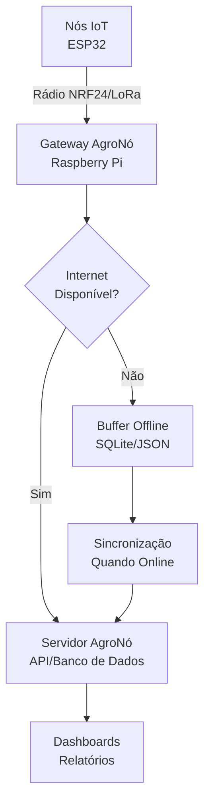
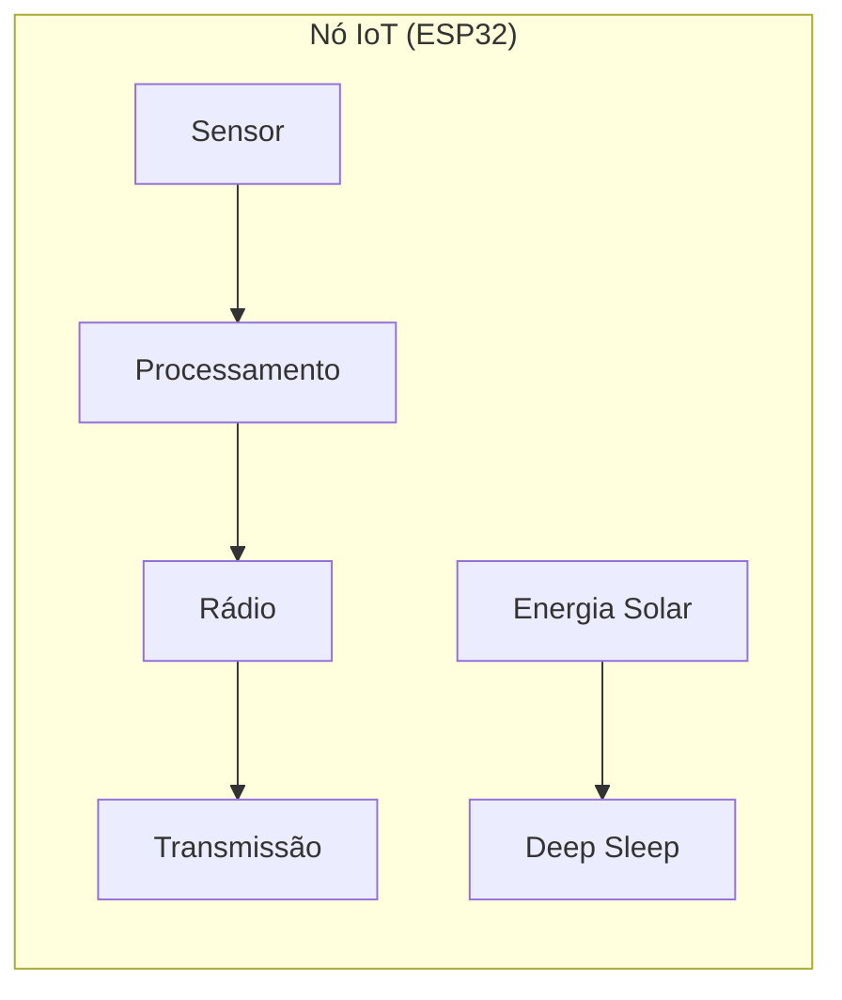
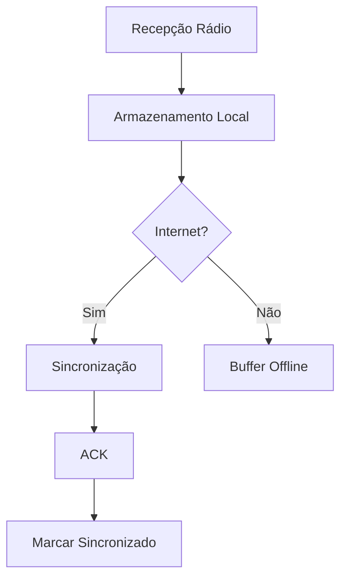
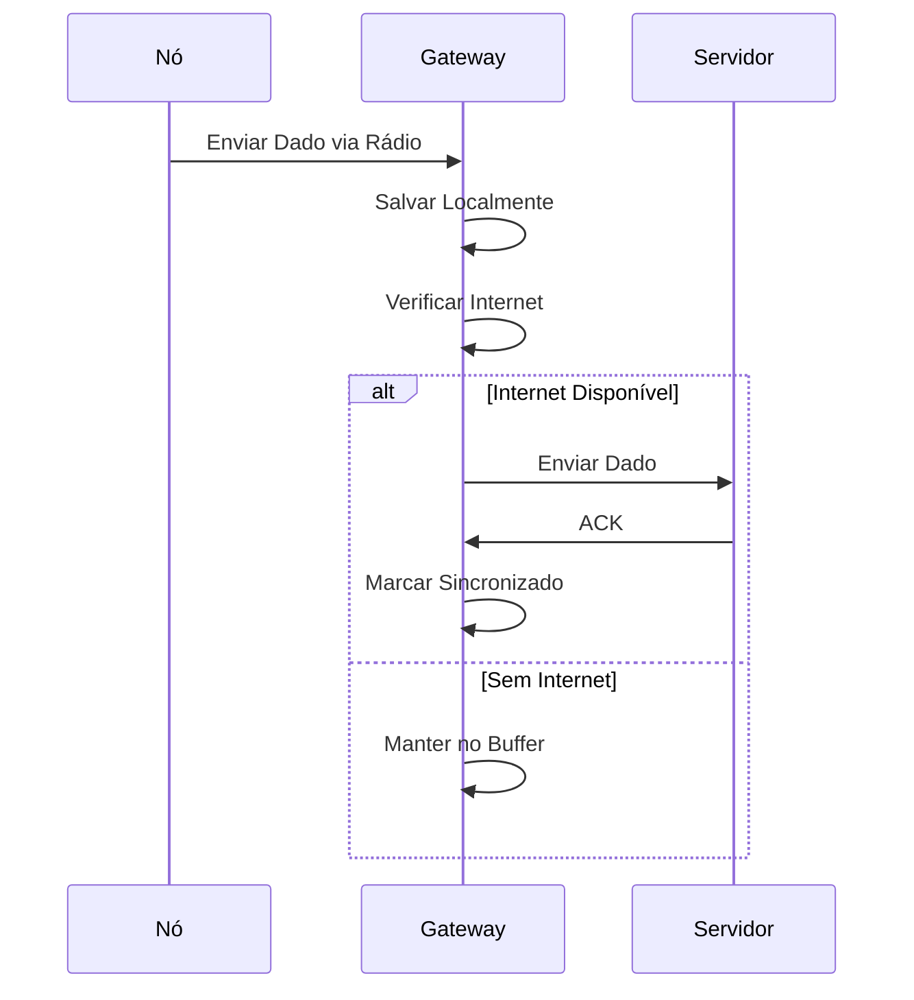
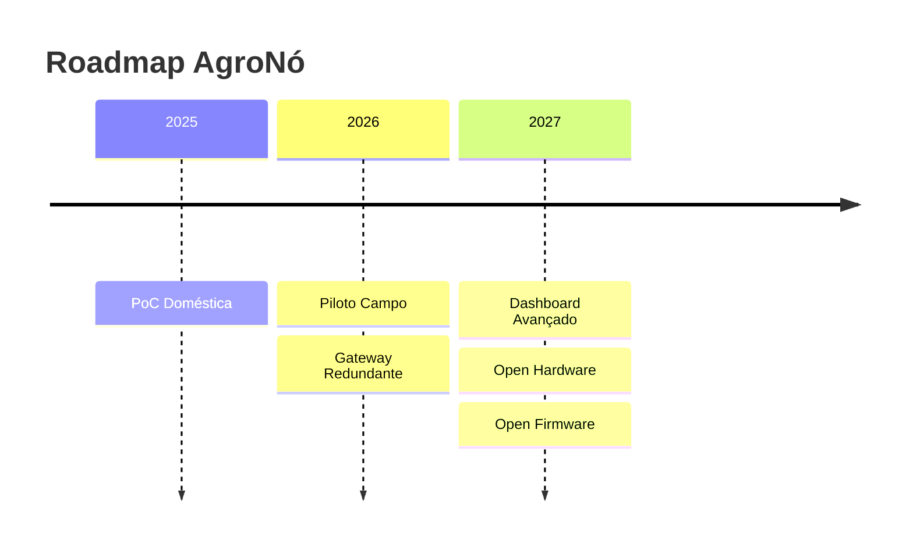

# Arquitetura do Sistema AgroNó

## Visão Geral da Arquitetura

## Componentes Detalhados

### Nós IoT

### Gateway AgroNó

### Fluxo de Mensagens

## Comunicação

### PoC Doméstica (NRF24)

### Campo Real (LoRa)

## Evolução do Sistema

