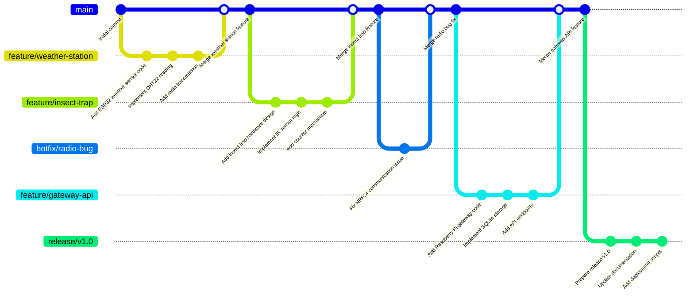

# Guia de Desenvolvimento - GitHub Flow

Este documento descreve o fluxo de desenvolvimento usado no projeto AgroNó, baseado no GitHub Flow.

## GitHub Flow

O GitHub Flow é um fluxo de trabalho leve e baseado em branches que ajuda equipes a entregar produtos de alta qualidade de forma rápida e eficiente.

### Princípios

- Qualquer coisa no branch `main` é implantável
- Criar branches descritivos a partir de `main`
- Fazer commits pequenos e frequentes
- Abrir Pull Request o mais cedo possível
- Revisar código e discutir mudanças
- Merge quando aprovado

## Fluxo de Desenvolvimento



## Branches

### Main Branch
- Branch principal e estável
- Sempre implantável
- Protegido contra pushes diretos
- Apenas merges via Pull Requests

### Feature Branches
- Criados a partir de `main`
- Nome: `feature/nome-da-feature`
- Focados em uma funcionalidade específica
- Deletados após merge

### Release Branches
- Preparação para releases
- Nome: `release/v1.0`
- Últimos ajustes e testes
- Merge de volta para `main` e `develop`

### Hotfix Branches
- Correções críticas em produção
- Nome: `hotfix/nome-do-bug`
- Criados a partir de `main`
- Merge de volta para `main` e `develop`

## Pull Requests

### Quando Criar
- Quando a feature estiver funcional
- Antes de considerar completa
- Para discutir mudanças significativas

### Processo de Review
1. Criar PR com descrição detalhada
2. Adicionar labels apropriadas
3. Solicitar review de pelo menos 1 pessoa
4. Discutir e implementar mudanças
5. Aprovar e merge

### Labels Comuns
- `enhancement`: Nova funcionalidade
- `bug`: Correção de bug
- `documentation`: Mudanças na documentação
- `refactor`: Refatoração de código
- `test`: Adição de testes

## Commits

### Formato
```
tipo: descrição breve

Descrição mais detalhada se necessário
```

### Tipos
- `feat`: Nova funcionalidade
- `fix`: Correção de bug
- `docs`: Mudanças na documentação
- `style`: Mudanças de estilo (formatação, etc.)
- `refactor`: Refatoração de código
- `test`: Adição ou correção de testes
- `chore`: Mudanças em ferramentas, config, etc.

### Exemplos
```
feat: add weather station ESP32 code

Implementa leitura de sensores DHT22 e transmissão
via rádio NRF24 para o gateway.
```

```
fix: correct radio transmission timeout

Aumenta timeout de 5 para 10 segundos para evitar
perda de pacotes em condições de sinal fraco.
```

## Issues e Projects

### Issues
- Descrição clara do problema/feature
- Labels para categorização
- Assignee responsável
- Milestone para versionamento
- Linked PRs

### Projects
- Boards Kanban para organização
- Automação de status
- Visão geral do progresso

## Releases

### Versionamento Semântico
- `MAJOR.MINOR.PATCH`
- `MAJOR`: Mudanças incompatíveis
- `MINOR`: Novas funcionalidades compatíveis
- `PATCH`: Correções de bugs

### Processo
1. Criar branch `release/v1.0`
2. Atualizar CHANGELOG.md
3. Testes finais
4. Criar GitHub Release
5. Deploy para produção
6. Merge para `main`

## Ferramentas

### GitHub Actions
- CI/CD automatizado
- Testes em cada PR
- Build e deploy automático
- CodeQL para segurança

### Code Quality
- ESLint/Prettier para JavaScript
- Black para Python
- Pre-commit hooks
- Codecov para cobertura de testes

## Boas Práticas

### Commits Pequenos
- Commits atômicos
- Fáceis de reverter
- Mensagens descritivas

### Branches Curtas
- Criar PR cedo
- Evitar branches longevas
- Merge frequente

### Code Review
- Revisão obrigatória
- Discussão construtiva
- Aprovação por pares

### Documentação
- README atualizado
- Documentação técnica
- Guias de contribuição

## Próximos Passos

- Implementar GitHub Actions para CI/CD
- Adicionar templates para Issues e PRs
- Configurar branch protection rules
- Implementar semantic versioning automático