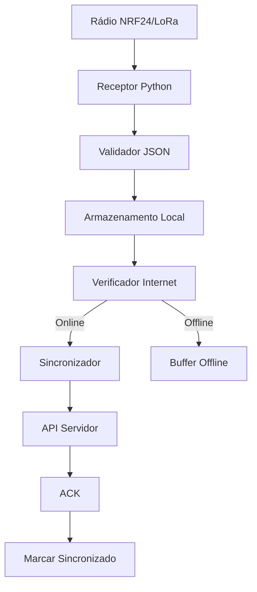

# Gateway AgroNó


O gateway é o componente central do sistema AgroNó, responsável por receber dados dos nós IoT via rádio, armazenar localmente e sincronizar com o servidor quando a internet estiver disponível.

## Hardware

- **Computador**: Raspberry Pi 4 ou similar
- **Rádio**: NRF24L01+ ou SX1276 (LoRa) + adaptador USB/SPI
- **Conectividade**: Wi-Fi, Ethernet, 4G/LTE (opcional)
- **Armazenamento**: SD Card ou SSD
- **Energia**: Fonte 5V USB ou bateria com UPS

## Software

### Arquitetura



### Componentes Principais

1. **Receptor de Rádio**: Escuta continuamente por mensagens
2. **Processador de Dados**: Valida e formata dados recebidos
3. **Armazenamento Local**: SQLite para persistência offline
4. **Sincronizador**: Envia dados para servidor quando online
5. **Monitor de Conectividade**: Verifica status da internet

### Código Principal (Python)

```python
import json
import sqlite3
import requests
import time
from RF24 import RF24

# Configurações
DB_PATH = 'agrono.db'
API_URL = 'http://servidor-agrono.com/api/dados'
RADIO_CHANNEL = 76
PIPE_ADDRESS = 0xF0F0F0F0E1LL

class AgroNoGateway:
    def __init__(self):
        self.radio = RF24(22, 0)  # GPIO 22 CE, SPI CE0
        self.setup_radio()
        self.setup_database()
        
    def setup_radio(self):
        self.radio.begin()
        self.radio.setChannel(RADIO_CHANNEL)
        self.radio.openReadingPipe(1, PIPE_ADDRESS)
        self.radio.startListening()
        
    def setup_database(self):
        self.conn = sqlite3.connect(DB_PATH)
        self.cursor = self.conn.cursor()
        self.cursor.execute('''CREATE TABLE IF NOT EXISTS dados (
            id INTEGER PRIMARY KEY,
            node_id TEXT,
            tipo TEXT,
            dados TEXT,
            timestamp TEXT,
            sync INTEGER DEFAULT 0
        )''')
        self.conn.commit()
        
    def receber_dados(self):
        if self.radio.available():
            length = self.radio.getDynamicPayloadSize()
            received_payload = self.radio.read(length)
            try:
                dados = json.loads(received_payload.decode('utf-8'))
                self.processar_dados(dados)
            except Exception as e:
                print(f"Erro ao processar dados: {e}")
                
    def processar_dados(self, dados):
        # Salvar no banco
        self.cursor.execute('INSERT INTO dados (node_id, tipo, dados, timestamp) VALUES (?, ?, ?, ?)',
                           (dados['node_id'], dados['tipo'], json.dumps(dados), dados['timestamp']))
        self.conn.commit()
        
        # Processamento específico por tipo
        if dados['tipo'] == 'meteorologia':
            self.processar_meteorologia(dados)
        elif dados['tipo'] == 'armadilha':
            self.processar_armadilha(dados)
        elif dados['tipo'] == 'solo':
            self.processar_solo(dados)
            
    def processar_meteorologia(self, dados):
        # Agregar dados meteorológicos
        pass
        
    def processar_armadilha(self, dados):
        # Agregar contagens de insetos
        pass
        
    def processar_solo(self, dados):
        # Calcular médias de solo
        pass
        
    def verificar_internet(self):
        try:
            requests.get('http://www.google.com', timeout=5)
            return True
        except:
            return False
            
    def sincronizar(self):
        if not self.verificar_internet():
            return
            
        self.cursor.execute('SELECT * FROM dados WHERE sync = 0 LIMIT 10')
        rows = self.cursor.fetchall()
        
        for row in rows:
            try:
                dados = json.loads(row[3])
                response = requests.post(API_URL, json=dados, timeout=10)
                if response.status_code == 200:
                    self.cursor.execute('UPDATE dados SET sync = 1 WHERE id = ?', (row[0],))
            except Exception as e:
                print(f"Erro na sincronização: {e}")
                break  # Parar se houver erro
                
        self.conn.commit()
        
    def run(self):
        while True:
            self.receber_dados()
            self.sincronizar()
            time.sleep(1)

if __name__ == '__main__':
    gateway = AgroNoGateway()
    gateway.run()
```

## Banco de Dados Local

### Tabelas Principais

- **dados**: Armazenamento bruto dos dados recebidos
- **medias_meteorologicas**: Agregação de dados meteorológicos
- **contagens_armadilhas**: Contagens diárias de insetos
- **medias_solo**: Médias horárias de parâmetros do solo

### Exemplo de Schema

```sql
CREATE TABLE dados (
    id INTEGER PRIMARY KEY,
    node_id TEXT,
    tipo TEXT,
    dados TEXT,
    timestamp TEXT,
    sync INTEGER DEFAULT 0
);

CREATE TABLE medias_meteorologicas (
    id INTEGER PRIMARY KEY,
    node_id TEXT,
    data_hora TEXT,
    temperatura_avg REAL,
    umidade_avg REAL,
    pressao_avg REAL,
    vento_avg REAL,
    chuva_total REAL,
    count INTEGER
);
```

## API do Servidor

### Endpoint: POST /api/dados

O gateway envia os dados coletados para este endpoint.

**Headers:**
- Content-Type: application/json

**Corpo da Requisição:**
```json
{
  "node_id": "MET_01",
  "tipo": "meteorologia",
  "temperatura": 25.5,
  "umidade": 65.2,
  "pressao": 1013.25,
  "vento": 12.5,
  "chuva": 0.0,
  "timestamp": "2025-12-28T10:00:00",
  "sync": false
}
```

**Resposta de Sucesso:**
```json
{
  "status": "success",
  "message": "Dados recebidos e processados",
  "id": 12345
}
```

**Resposta de Erro:**
```json
{
  "status": "error",
  "message": "Erro ao processar dados",
  "details": "Campo 'node_id' obrigatório"
}
```

## Monitoramento e Manutenção

- **Logs**: Registrar todas as operações
- **Status**: Endpoint para verificar saúde do gateway
- **Reinicialização**: Script para restart automático
- **Backup**: Sincronização periódica de dados críticos

## Próximos Passos

- Implementar compressão de dados para economia de banda
- Adicionar autenticação com o servidor
- Suporte a múltiplos canais de rádio
- Interface web local para configuração