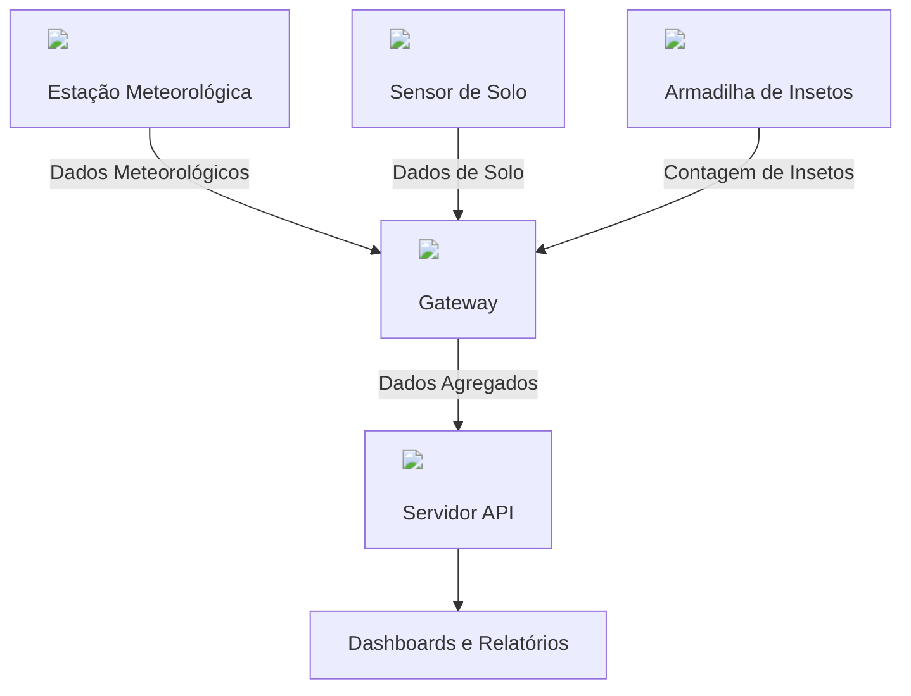

# Welcome to AgroNó

Plataforma IoT Agrícola de Baixo Custo • Offline-First • Open Source

## Arquitetura Geral do Sistema



## 1️⃣ Visão Geral

O AgroNó é uma plataforma de Internet das Coisas (IoT) voltada para monitoramento agrícola, projetada para operar em ambientes rurais com pouca ou nenhuma conectividade.

O projeto foca em:

- Baixo custo
- Alta confiabilidade
- Funcionamento offline
- Escalabilidade
- Uso de hardware acessível (ESP32, Raspberry, impressão 3D)

## 2️⃣ Problema que o AgroNó resolve

Em áreas agrícolas:

- Internet é instável ou inexistente
- Sensores dependem de nuvem
- Perda de dados é comum
- Soluções comerciais são caras

O AgroNó resolve isso com:

- Comunicação local via rádio
- Gateway com buffer offline
- Sincronização inteligente
- Arquitetura tolerante a falhas

## 3️⃣ Conceito Central (Offline-First)

Nenhum nó depende de internet para funcionar.
Nenhum dado é perdido se a internet cair.

Esse conceito é conhecido como Store & Forward e é amplamente usado em:

- Agricultura
- Mineração
- Petróleo
- Monitoramento ambiental

## 4️⃣ Arquitetura Geral

```
┌─────────────┐
│   Nós IoT   │
│ (ESP32)     │
└─────┬───────┘
      │ Rádio (NRF24 / LoRa)
      │ Comunicação local
      ▼
┌────────────────────┐
│ Gateway AgroNó     │
│ - Recepção rádio   │
│ - Buffer offline   │
│ - Persistência     │
│ - Sincronização    │
└─────┬──────────────┘
      │ Internet opcional
      │ (Wi-Fi / 4G / Satélite)
      ▼
┌────────────────────┐
│ Servidor AgroNó    │
│ - API              │
│ - Banco de dados   │
│ - Análise          │
│ - Dashboard        │
└────────────────────┘
```

## 5️⃣ Componentes do Sistema

### 🌱 Nós IoT

Dispositivos simples, robustos e de baixo consumo.

Exemplos de nós:

- Estação meteorológica
- Armadilha automática de insetos
- Sensor de solo

Características:

- ESP32 / ESP32-CAM
- Rádio (NRF24 ou LoRa)
- Energia solar (campo)
- Deep sleep
- 100% offline

### 📡 Gateway AgroNó

O gateway é o coração do sistema.

Responsabilidades:

- Receber mensagens via rádio
- Armazenar dados localmente
- Manter buffer offline
- Sincronizar com servidor quando possível

Armazenamento local:

- JSON
- SQLite
- CSV rotativo

Exemplo de mensagem:

```json
{
  "node_id": "ARM_01",
  "tipo": "armadilha",
  "evento": "entrada",
  "contador": 132,
  "timestamp": "2025-01-14T18:42:00",
  "sync": false
}
```

### 🖥 Servidor AgroNó

O servidor não participa da coleta.

Funções:

- Armazenamento central
- Análise histórica
- Dashboards
- Relatórios
- Alertas

Pode rodar:

- Localmente
- VPS
- Nuvem pública
- Universidade / laboratório

## 6️⃣ Comunicação

### PoC doméstica

- NRF24L01
- Curta distância (até ~100 m)
- Fácil debug
- Baixo custo

### Campo real

- LoRa (SX1276 – 915 MHz)
- Longo alcance
- Baixíssimo consumo
- Ideal para agricultura

🔁 A arquitetura não muda, apenas o rádio.

## 7️⃣ Fluxo de Mensagens

1. Nó coleta dado
2. Nó envia via rádio
3. Gateway recebe
4. Gateway salva localmente
5. Internet disponível?
   - Sim → Envia ao servidor → ACK → Marca como sincronizado
   - Não → Mantém no buffer

## 8️⃣ PoC Doméstica (Validação Inicial)

Objetivo:
Validar arquitetura antes de ir a campo.

Setup típico:

- ESP32 + NRF24
- Gateway ESP32 ou Raspberry
- Servidor local
- Wi-Fi doméstico
- Nenhuma dependência externa.

## 9️⃣ Evolução para Campo

Sem mudar arquitetura:

- NRF24 → LoRa
- USB → Energia solar
- Caixa simples → Caixa IP65
- Antena interna → Antena externa

## 🔟 Roadmap

- ✅ PoC doméstica
- 🔜 Piloto em pequena área agrícola
- 🔜 Gateway redundante
- 🔜 Dashboard avançado
- 🔜 Open hardware + open firmware

## 🧠 Resumo Executivo

O AgroNó é uma plataforma IoT agrícola offline-first, baseada em nós simples, um gateway inteligente com buffer local e um servidor desacoplado.
A solução prioriza confiabilidade, baixo custo e operação em áreas rurais sem internet constante.