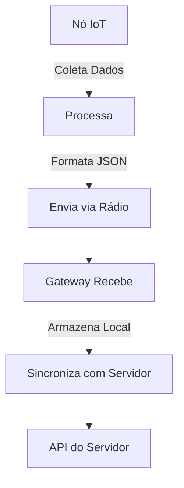

# Nós IoT do AgroNó

Esta seção documenta os diferentes tipos de nós IoT desenvolvidos para o sistema AgroNó. Todos os nós utilizam ESP32 como microcontrolador principal, comunicação via rádio (NRF24 ou LoRa) e seguem o mesmo padrão de envio de dados para o gateway.

## Características Gerais dos Nós

- **Hardware**: ESP32 / ESP32-CAM
- **Comunicação**: Rádio NRF24 (PoC) ou LoRa (campo)
- **Energia**: Bateria com painel solar
- **Modo de Economia**: Deep Sleep
- **Dados**: Envio periódico ou por evento
- **Formato**: JSON via rádio

## Tipos de Nós

- [Estação Meteorológica](weather-station.md)
- [Armadilha de Insetos](insect-trap.md)
- [Sensor de Solo](soil-sensor.md)

## Fluxo Geral de Dados

