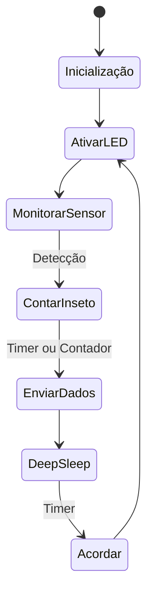

# Armadilha de Insetos


A armadilha de insetos é um dispositivo automatizado para monitoramento de pragas agrícolas. Conta insetos capturados e envia dados periodicamente.

## Hardware

- **Microcontrolador**: ESP32
- **Sensores**:
  - Sensor infravermelho (IR) ou fotocélula para detecção de passagem
  - Contador mecânico ou óptico
- **Atuadores**:
  - Motor para abertura/fechamento da armadilha
  - LED UV para atração de insetos
- **Rádio**: NRF24L01+ ou SX1276 (LoRa)
- **Energia**: Bateria LiPo 18650 + Painel Solar 5V
- **Caixa**: IP65 com funil para insetos

## Software

### Lógica de Funcionamento



### Código Principal (Pseudocódigo)

```cpp
#include <ESP32WiFi.h>
#include <RF24.h>

// Configurações
#define NODE_ID "ARM_01"
#define SENSOR_PIN 34
#define LED_PIN 12
#define RADIO_CE 22
#define RADIO_CS 21

RF24 radio(RADIO_CE, RADIO_CS);
volatile int contador = 0;
unsigned long ultimoEnvio = 0;

void IRAM_ATTR contarInseto() {
    contador++;
}

void setup() {
    Serial.begin(115200);
    pinMode(SENSOR_PIN, INPUT);
    pinMode(LED_PIN, OUTPUT);
    attachInterrupt(digitalPinToInterrupt(SENSOR_PIN), contarInseto, RISING);

    radio.begin();
    radio.setChannel(76);
    radio.openWritingPipe(0xF0F0F0F0E1LL);
    radio.setPALevel(RF24_PA_LOW);
    radio.stopListening();
}

void loop() {
    digitalWrite(LED_PIN, HIGH);  // Ativar LED UV

    // Enviar dados a cada 1 hora ou quando contador > 10
    if (millis() - ultimoEnvio > 3600000 || contador > 10) {
        String data = "{";
        data += "\"node_id\":\"" + String(NODE_ID) + "\",";
        data += "\"tipo\":\"armadilha\",";
        data += "\"evento\":\"contagem\",";
        data += "\"contador\":" + String(contador) + ",";
        data += "\"timestamp\":\"" + getTimestamp() + "\",";
        data += "\"sync\":false";
        data += "}";

        radio.write(data.c_str(), data.length());
        ultimoEnvio = millis();
        contador = 0;  // Reset contador após envio
    }

    // Deep Sleep por 5 minutos
    esp_sleep_enable_timer_wakeup(5 * 60 * 1000000);
    digitalWrite(LED_PIN, LOW);
    esp_deep_sleep_start();
}

String getTimestamp() {
    return "2025-12-28T10:00:00";
}
```

## Formato de Dados

```json
{
  "node_id": "ARM_01",
  "tipo": "armadilha",
  "evento": "contagem",
  "contador": 15,
  "timestamp": "2025-12-28T10:00:00",
  "sync": false
}
```

## Gateway - Processamento

Semelhante à estação meteorológica, mas com foco em contagem acumulada.

### Código Específico

```python
# No loop do gateway
def processar_armadilha(dados):
    # Agregar contagens por dia
    cursor.execute('SELECT SUM(contador) FROM dados WHERE node_id = ? AND tipo = ? AND DATE(timestamp) = DATE(?)',
                   (dados['node_id'], 'armadilha', dados['timestamp'][:10]))
    total = cursor.fetchone()[0] or 0
    total += dados['contador']
    
    # Salvar ou atualizar
    cursor.execute('INSERT OR REPLACE INTO contagens_diarias (node_id, data, total) VALUES (?, ?, ?)',
                   (dados['node_id'], dados['timestamp'][:10], total))
    conn.commit()
```

## API do Servidor

### Endpoint: POST /api/dados

**Exemplo de Request:**

```json
{
  "node_id": "ARM_01",
  "tipo": "armadilha",
  "evento": "contagem",
  "contador": 15,
  "timestamp": "2025-12-28T10:00:00",
  "sync": false
}
```

**Resposta:**

```json
{
  "status": "success",
  "message": "Contagem de insetos registrada"
}
```

## Próximos Passos

- Otimizar consumo de energia do LED UV
- Adicionar câmera para identificação de insetos
- Alertas automáticos quando contagem exceder threshold
- Integração com modelos de previsão de pragas