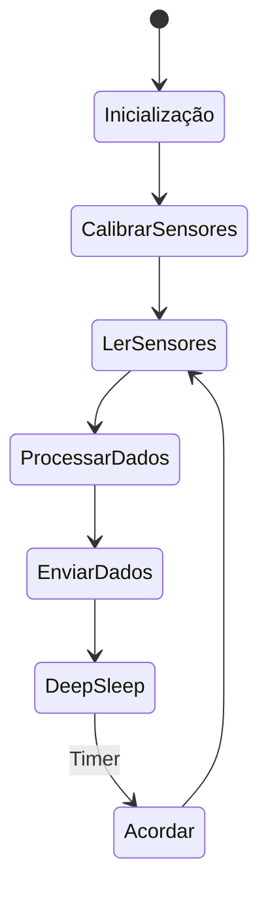

# Sensor de Solo


O sensor de solo monitora parâmetros importantes para agricultura como umidade, temperatura do solo, pH e condutividade elétrica (salinidade).

## Hardware

- **Microcontrolador**: ESP32
- **Sensores**:
  - Sensor de umidade do solo (capacitivo ou resistivo)
  - Termistor ou DS18B20 (temperatura do solo)
  - Sensor pH
  - Sensor de condutividade elétrica
- **Rádio**: NRF24L01+ ou SX1276 (LoRa)
- **Energia**: Bateria LiPo 18650 + Painel Solar 5V
- **Caixa**: IP68 para enterramento parcial

## Software

### Lógica de Funcionamento



### Código Principal (Pseudocódigo)

```cpp
#include <ESP32WiFi.h>
#include <RF24.h>
#include <OneWire.h>
#include <DallasTemperature.h>

// Configurações
#define NODE_ID "SOL_01"
#define SOIL_MOISTURE_PIN 34
#define SOIL_TEMP_PIN 4
#define PH_PIN 35
#define EC_PIN 32
#define RADIO_CE 22
#define RADIO_CS 21

RF24 radio(RADIO_CE, RADIO_CS);
OneWire oneWire(SOIL_TEMP_PIN);
DallasTemperature sensors(&oneWire);

void setup() {
    Serial.begin(115200);
    sensors.begin();
    radio.begin();
    radio.setChannel(76);
    radio.openWritingPipe(0xF0F0F0F0E1LL);
    radio.setPALevel(RF24_PA_LOW);
    radio.stopListening();
}

void loop() {
    // Ler sensores
    int moistureRaw = analogRead(SOIL_MOISTURE_PIN);
    float moisture = map(moistureRaw, 0, 4095, 0, 100);  // Calibrar

    sensors.requestTemperatures();
    float soilTemp = sensors.getTempCByIndex(0);

    int phRaw = analogRead(PH_PIN);
    float ph = map(phRaw, 0, 4095, 0, 14);  // Calibrar

    int ecRaw = analogRead(EC_PIN);
    float ec = map(ecRaw, 0, 4095, 0, 2000);  // Calibrar em µS/cm

    // Formatar JSON
    String data = "{";
    data += "\"node_id\":\"" + String(NODE_ID) + "\",";
    data += "\"tipo\":\"solo\",";
    data += "\"umidade\":" + String(moisture) + ",";
    data += "\"temperatura_solo\":" + String(soilTemp) + ",";
    data += "\"ph\":" + String(ph) + ",";
    data += "\"condutividade\":" + String(ec) + ",";
    data += "\"timestamp\":\"" + getTimestamp() + "\",";
    data += "\"sync\":false";
    data += "}";

    // Enviar via rádio
    radio.write(data.c_str(), data.length());

    // Deep Sleep por 30 minutos
    esp_sleep_enable_timer_wakeup(30 * 60 * 1000000);
    esp_deep_sleep_start();
}

String getTimestamp() {
    return "2025-12-28T10:00:00";
}
```

## Formato de Dados

```json
{
  "node_id": "SOL_01",
  "tipo": "solo",
  "umidade": 45.2,
  "temperatura_solo": 22.5,
  "ph": 6.8,
  "condutividade": 850,
  "timestamp": "2025-12-28T10:00:00",
  "sync": false
}
```

## Gateway - Processamento

O gateway pode agregar dados por zona de irrigação.

### Código Específico

```python
def processar_solo(dados):
    # Calcular médias por hora
    hora = dados['timestamp'][:13]  # YYYY-MM-DDTHH
    cursor.execute('''INSERT INTO medias_solo (node_id, hora, umidade_avg, temp_avg, ph_avg, ec_avg, count)
                      VALUES (?, ?, ?, ?, ?, ?, 1)
                      ON CONFLICT(node_id, hora) DO UPDATE SET
                      umidade_avg = (umidade_avg * count + ?) / (count + 1),
                      temp_avg = (temp_avg * count + ?) / (count + 1),
                      ph_avg = (ph_avg * count + ?) / (count + 1),
                      ec_avg = (ec_avg * count + ?) / (count + 1),
                      count = count + 1''',
                   (dados['node_id'], hora, dados['umidade'], dados['temperatura_solo'], dados['ph'], dados['condutividade'],
                    dados['umidade'], dados['temperatura_solo'], dados['ph'], dados['condutividade']))
    conn.commit()
```

## API do Servidor

### Endpoint: POST /api/dados

**Exemplo de Request:**

```json
{
  "node_id": "SOL_01",
  "tipo": "solo",
  "umidade": 45.2,
  "temperatura_solo": 22.5,
  "ph": 6.8,
  "condutividade": 850,
  "timestamp": "2025-12-28T10:00:00",
  "sync": false
}
```

**Resposta:**

```json
{
  "status": "success",
  "message": "Dados de solo registrados"
}
```

## Próximos Passos

- Calibração precisa dos sensores
- Adicionar sensor de nitrogênio (NDVI)
- Integração com sistemas de irrigação
- Alertas para condições críticas do solo