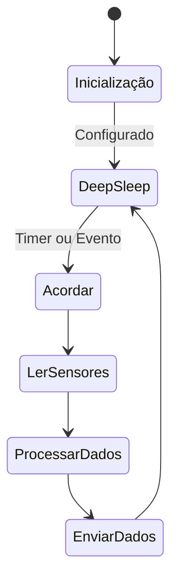

# Estação Meteorológica


A estação meteorológica é um nó IoT responsável por coletar dados ambientais como temperatura, umidade, pressão atmosférica, velocidade do vento e precipitação.

## Hardware

- **Microcontrolador**: ESP32
- **Sensores**:
  - DHT22 ou BME280 (temperatura, umidade)
  - BMP180 ou BME280 (pressão)
  - Anemômetro (velocidade do vento)
  - Pluviômetro (precipitação)
- **Rádio**: NRF24L01+ ou SX1276 (LoRa)
- **Energia**: Bateria LiPo 18650 + Painel Solar 5V
- **Caixa**: IP65 para proteção externa

## Software

### Lógica de Funcionamento



### Código Principal (Pseudocódigo)

```cpp
#include <ESP32WiFi.h>
#include <RF24.h>
#include <DHT.h>
#include <Wire.h>
#include <Adafruit_BMP280.h>

// Configurações
#define NODE_ID "MET_01"
#define DHT_PIN 4
#define RADIO_CE 22
#define RADIO_CS 21

RF24 radio(RADIO_CE, RADIO_CS);
DHT dht(DHT_PIN, DHT22);
Adafruit_BMP280 bmp;

void setup() {
    Serial.begin(115200);
    dht.begin();
    bmp.begin(0x76);
    radio.begin();
    radio.setChannel(76);
    radio.openWritingPipe(0xF0F0F0F0E1LL);
    radio.setPALevel(RF24_PA_LOW);
    radio.stopListening();
}

void loop() {
    // Ler sensores
    float temp = dht.readTemperature();
    float hum = dht.readHumidity();
    float press = bmp.readPressure() / 100.0F;
    // Simular vento e chuva (sensores reais necessários)
    float wind = random(0, 50);
    float rain = random(0, 10);

    // Formatar JSON
    String data = "{";
    data += "\"node_id\":\"" + String(NODE_ID) + "\",";
    data += "\"tipo\":\"meteorologia\",";
    data += "\"temperatura\":" + String(temp) + ",";
    data += "\"umidade\":" + String(hum) + ",";
    data += "\"pressao\":" + String(press) + ",";
    data += "\"vento\":" + String(wind) + ",";
    data += "\"chuva\":" + String(rain) + ",";
    data += "\"timestamp\":\"" + getTimestamp() + "\",";
    data += "\"sync\":false";
    data += "}";

    // Enviar via rádio
    radio.write(data.c_str(), data.length());

    // Deep Sleep por 10 minutos
    esp_sleep_enable_timer_wakeup(10 * 60 * 1000000);
    esp_deep_sleep_start();
}

String getTimestamp() {
    // Implementar NTP ou RTC
    return "2025-12-28T10:00:00";
}
```

## Formato de Dados

```json
{
  "node_id": "MET_01",
  "tipo": "meteorologia",
  "temperatura": 25.5,
  "umidade": 65.2,
  "pressao": 1013.25,
  "vento": 12.5,
  "chuva": 0.0,
  "timestamp": "2025-12-28T10:00:00",
  "sync": false
}
```

## Gateway - Processamento

O gateway recebe os dados via rádio e os processa da seguinte forma:

1. **Recepção**: Escuta continuamente no canal de rádio
2. **Validação**: Verifica integridade do JSON
3. **Armazenamento**: Salva em buffer local (SQLite ou JSON)
4. **Sincronização**: Quando online, envia para API do servidor

### Código Gateway (Python com Raspberry Pi)

```python
import json
import sqlite3
import requests
from RF24 import RF24

# Configurações
DB_PATH = 'agrono.db'
API_URL = 'http://servidor-agrono.com/api/dados'

radio = RF24(22, 0)  # GPIO 22 CE, SPI CE0
radio.begin()
radio.setChannel(76)
radio.openReadingPipe(1, 0xF0F0F0F0E1LL)
radio.startListening()

conn = sqlite3.connect(DB_PATH)
cursor = conn.cursor()
cursor.execute('''CREATE TABLE IF NOT EXISTS dados (
    id INTEGER PRIMARY KEY,
    node_id TEXT,
    tipo TEXT,
    dados TEXT,
    timestamp TEXT,
    sync INTEGER DEFAULT 0
)''')

def salvar_dados(dados):
    cursor.execute('INSERT INTO dados (node_id, tipo, dados, timestamp) VALUES (?, ?, ?, ?)',
                   (dados['node_id'], dados['tipo'], json.dumps(dados), dados['timestamp']))
    conn.commit()

def sincronizar():
    cursor.execute('SELECT * FROM dados WHERE sync = 0')
    rows = cursor.fetchall()
    for row in rows:
        try:
            response = requests.post(API_URL, json=json.loads(row[3]))
            if response.status_code == 200:
                cursor.execute('UPDATE dados SET sync = 1 WHERE id = ?', (row[0],))
        except:
            pass  # Tentar novamente depois
    conn.commit()

while True:
    if radio.available():
        length = radio.getDynamicPayloadSize()
        received_payload = radio.read(length)
        try:
            dados = json.loads(received_payload.decode())
            salvar_dados(dados)
        except:
            pass  # Dados inválidos

    # Sincronizar periodicamente
    sincronizar()
    time.sleep(60)  # A cada minuto
```

## API do Servidor

### Endpoint: POST /api/dados

Recebe os dados dos nós via gateway.

**Exemplo de Request:**

```json
{
  "node_id": "MET_01",
  "tipo": "meteorologia",
  "temperatura": 25.5,
  "umidade": 65.2,
  "pressao": 1013.25,
  "vento": 12.5,
  "chuva": 0.0,
  "timestamp": "2025-12-28T10:00:00",
  "sync": false
}
```

**Resposta:**

```json
{
  "status": "success",
  "message": "Dados recebidos"
}
```

## Próximos Passos

- Implementar sensores reais para vento e chuva
- Adicionar GPS para localização
- Calibração e validação de dados
- Testes em campo