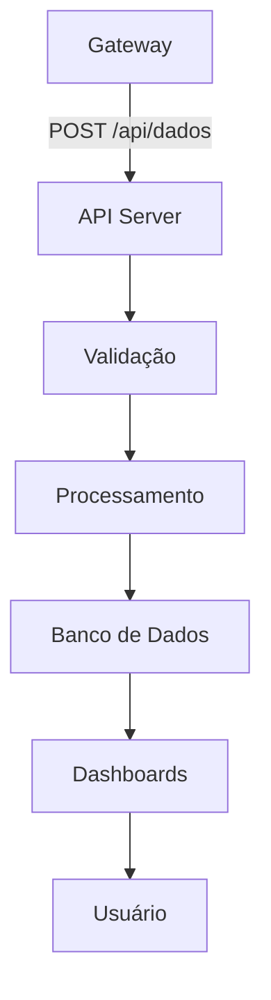

# API do Servidor AgroNó


A API do servidor AgroNó recebe dados dos gateways, processa, armazena e fornece endpoints para dashboards e relatórios.

## Arquitetura



## Tecnologias

- **Framework**: Node.js + Express ou Python + FastAPI
- **Banco de Dados**: PostgreSQL ou MongoDB
- **Autenticação**: JWT
- **Documentação**: Swagger/OpenAPI

## Endpoints Principais

### POST /api/dados

Recebe dados dos nós via gateway.

**Autenticação:** Bearer Token do gateway

**Corpo da Requisição:**
```json
{
  "node_id": "MET_01",
  "tipo": "meteorologia",
  "temperatura": 25.5,
  "umidade": 65.2,
  "pressao": 1013.25,
  "vento": 12.5,
  "chuva": 0.0,
  "timestamp": "2025-12-28T10:00:00",
  "sync": false
}
```

**Resposta:**
```json
{
  "status": "success",
  "id": 12345,
  "message": "Dados armazenados com sucesso"
}
```

### GET /api/nodes

Lista todos os nós registrados.

**Resposta:**
```json
[
  {
    "node_id": "MET_01",
    "tipo": "meteorologia",
    "localizacao": "Campo A",
    "ultimo_contato": "2025-12-28T10:00:00",
    "status": "online"
  }
]
```

### `GET /api/dados/{node_id}`

Obtém dados históricos de um nó.

**Parâmetros de Query:**
- start_date: Data inicial (YYYY-MM-DD)
- end_date: Data final (YYYY-MM-DD)
- limit: Número máximo de registros

**Resposta:**
```json
{
  "node_id": "MET_01",
  "tipo": "meteorologia",
  "dados": [
    {
      "timestamp": "2025-12-28T10:00:00",
      "temperatura": 25.5,
      "umidade": 65.2
    }
  ]
}
```

### GET /api/dashboard/summary

Resumo para dashboard principal.

**Resposta:**
```json
{
  "total_nodes": 15,
  "nodes_online": 12,
  "alertas": [
    {
      "tipo": "umidade_solo_baixa",
      "node_id": "SOL_01",
      "mensagem": "Umidade do solo abaixo de 30%"
    }
  ],
  "metricas": {
    "temperatura_media": 24.5,
    "umidade_media": 62.3,
    "precipitacao_total": 15.2
  }
}
```

## Processamento de Dados

### Validação

- Verificar campos obrigatórios
- Validar tipos de dados
- Verificar ranges realistas
- Detectar dados duplicados

### Agregação

- Médias horárias/diárias
- Tendências
- Alertas baseados em thresholds

### Armazenamento

```sql
CREATE TABLE dados (
    id SERIAL PRIMARY KEY,
    node_id VARCHAR(50),
    tipo VARCHAR(50),
    dados JSONB,
    timestamp TIMESTAMP,
    criado_em TIMESTAMP DEFAULT NOW()
);

CREATE TABLE nodes (
    node_id VARCHAR(50) PRIMARY KEY,
    tipo VARCHAR(50),
    localizacao VARCHAR(100),
    configuracao JSONB,
    ultimo_contato TIMESTAMP,
    status VARCHAR(20)
);
```

## Segurança

- **HTTPS**: Obrigatório em produção
- **Autenticação**: Tokens JWT para gateways
- **Rate Limiting**: Prevenção de abuso
- **Logs**: Auditoria de todas as operações
- **Backup**: Estratégia de backup diário

## Escalabilidade

- **Cache**: Redis para dados frequentes
- **Fila**: RabbitMQ para processamento assíncrono
- **Load Balancer**: Distribuição de carga
- **Microserviços**: Separação por domínio (dados, alertas, relatórios)

## Monitoramento

- **Métricas**: Response times, error rates
- **Logs**: Centralizados com ELK stack
- **Alertas**: Notificações automáticas
- **Health Checks**: Endpoints de saúde

## Próximos Passos

- Implementar WebSockets para dados em tempo real
- Adicionar machine learning para previsões
- API para integração com sistemas externos
- Documentação interativa com Swagger