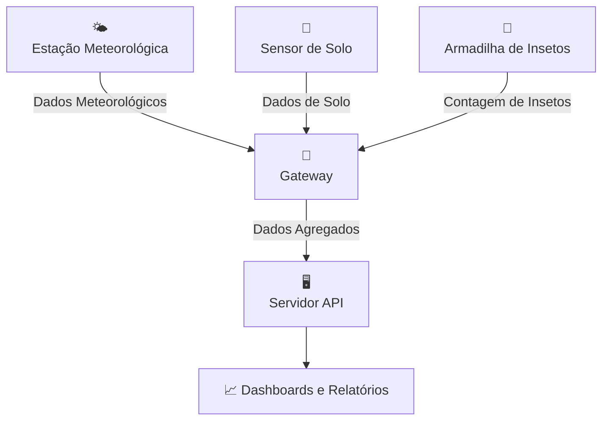

# 🌱 AgroNó - Plataforma IoT Agrícola

<p align="center">
  
</p>

<p align="center">
  <strong>Plataforma IoT Agrícola de Baixo Custo • Offline-First • Open Source</strong>
</p>

<p align="center">
  <a href="#visão-geral">Visão Geral</a> •
  <a href="#arquitetura">Arquitetura</a> •
  <a href="#instalação">Instalação</a> •
  <a href="#documentação">Documentação</a> •
  <a href="#contribuição">Contribuição</a>
</p>

---

## 🌟 Visão Geral

O **AgroNó** é uma plataforma completa de Internet das Coisas (IoT) desenvolvida especificamente para monitoramento agrícola em ambientes rurais com conectividade limitada ou inexistente.

### ✨ Características Principais

- **🔋 Offline-First**: Funciona sem internet, sincronizando quando disponível
- **💰 Baixo Custo**: Hardware acessível baseado em ESP32 e Raspberry Pi
- **🔄 Escalável**: Suporte a múltiplos nós e gateways
- **🌐 Open Source**: Código aberto e hardware documentado
- **📊 Dashboards**: Visualização em tempo real dos dados agrícolas

## 🏗️ Arquitetura



### 📡 Componentes do Sistema

| Componente | Descrição | Status |
|------------|-----------|--------|
| **Nós IoT** | Sensores ESP32 para coleta de dados | ✅ Implementado |
| **Gateway** | Raspberry Pi para agregação e sincronização | ✅ Implementado |
| **Servidor API** | Backend para processamento e armazenamento | ✅ Implementado |
| **Dashboards** | Interface web para visualização | 🚧 Em desenvolvimento |

## 🚀 Instalação

### Pré-requisitos

- Node.js 18+ para a documentação
- Python 3.8+ para o servidor
- ESP32 para nós IoT
- Raspberry Pi para gateway

### 📚 Documentação

```bash
# Clonar o repositório
git clone https://github.com/seu-usuario/agrono.git
cd agrono

# Instalar dependências da documentação
npm install

# Executar servidor de desenvolvimento
npm run start
```

Acesse [http://localhost:3000](http://localhost:3000) para ver a documentação completa.

## 📖 Documentação

- [**📋 Introdução**](https://agrono-docs.netlify.app/docs/intro) - Visão geral do projeto
- [**🏛️ Arquitetura**](https://agrono-docs.netlify.app/docs/architecture) - Diagramas técnicos detalhados
- [**🌤️ Nós IoT**](https://agrono-docs.netlify.app/docs/nodes/) - Documentação dos sensores
- [**📡 Gateway**](https://agrono-docs.netlify.app/docs/gateway) - Configuração do gateway
- [**🖥️ API do Servidor**](https://agrono-docs.netlify.app/docs/server-api) - Referência da API
- [**⚙️ Desenvolvimento**](https://agrono-docs.netlify.app/docs/development) - Guia para contribuidores

## 🤝 Contribuição

Contribuições são bem-vindas! Veja como participar:

1. Fork o projeto
2. Crie uma branch para sua feature (`git checkout -b feature/AmazingFeature`)
3. Commit suas mudanças (`git commit -m 'Add some AmazingFeature'`)
4. Push para a branch (`git push origin feature/AmazingFeature`)
5. Abra um Pull Request

### 📋 Tipos de Contribuição

- 🐛 **Bug fixes**
- ✨ **Novas funcionalidades**
- 📚 **Documentação**
- 🎨 **UI/UX**
- 🧪 **Testes**

## 📄 Licença

Este projeto está sob a licença MIT - veja o arquivo [LICENSE](LICENSE) para detalhes.

## 🙏 Agradecimentos

- Comunidade ESP32 e Raspberry Pi
- Projeto Docusaurus pela documentação
- Todos os contribuidores e apoiadores

## 📞 Contato

- **Email**: contato@agrono.io
- **GitHub**: [https://github.com/seu-usuario/agrono](https://github.com/seu-usuario/agrono)
- **Documentação**: [https://agrono-docs.netlify.app](https://agrono-docs.netlify.app)

---

<p align="center">
  <strong>Feito com ❤️ para agricultura sustentável</strong>
</p>