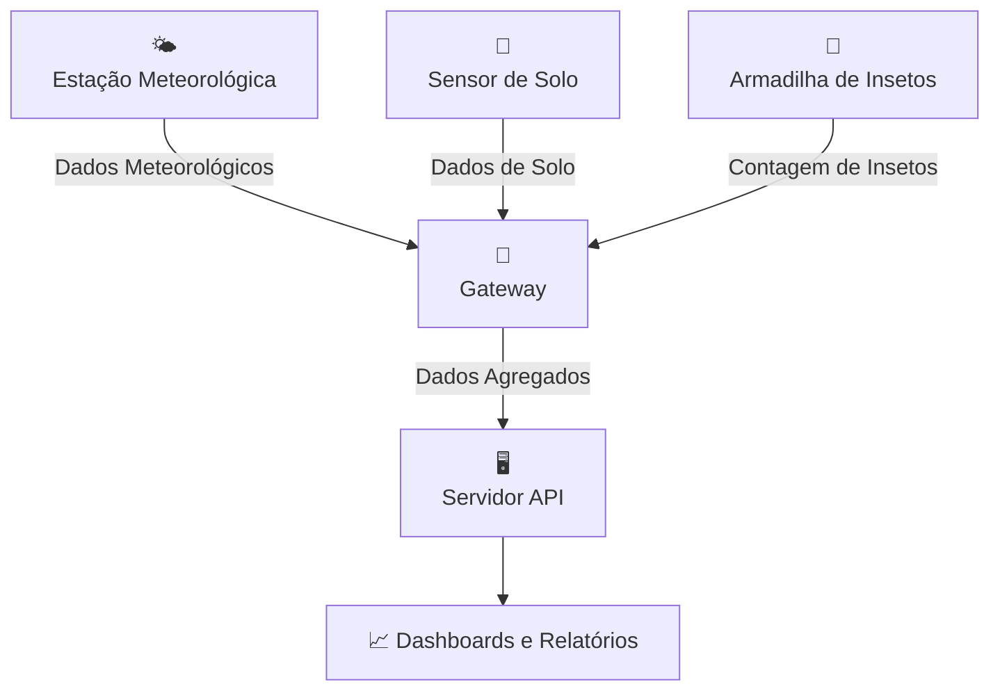

# 🌱 AgroNó - Plataforma IoT Agrícola

  

  <strong>Plataforma IoT Agrícola de Baixo Custo • Offline-First • Open Source</strong>

  <a href="#visão-geral">Visão Geral</a> •
  <a href="#arquitetura">Arquitetura</a> •
  <a href="#instalação">Instalação</a> •
  <a href="#documentação">Documentação</a> •
  <a href="#contribuição">Contribuição</a>

---

## 🌟 Visão Geral

O **AgroNó** é uma plataforma completa de Internet das Coisas (IoT) desenvolvida especificamente para monitoramento agrícola em ambientes rurais com conectividade limitada ou inexistente.

### ✨ Características Principais

- **🔋 Offline-First**: Funciona sem internet, sincronizando quando disponível
- **💰 Baixo Custo**: Hardware acessível baseado em ESP32 e Raspberry Pi
- **🔄 Escalável**: Suporte a múltiplos nós e gateways
- **🌐 Open Source**: Código aberto e hardware documentado
- **📊 Dashboards**: Visualização em tempo real dos dados agrícolas

## 🏗️ Arquitetura

## 📄 Licença

Este projeto está sob a licença MIT - veja o arquivo [LICENSE](LICENSE) para detalhes.

  <strong>Feito com ❤️ para agricultura sustentável</strong>

